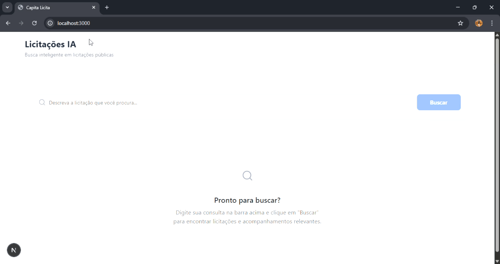

# API para Extração de Filtros de Licitações com Gemini

Este projeto consiste em uma API desenvolvida com Next.js que utiliza o modelo Gemini da Google para extrair informações relevantes (palavras-chave, sinônimos, faixa de valores e estado) a partir de perguntas sobre licitações.

## 🎥 Demonstração Visual



> A demonstração acima mostra a API recebendo uma pergunta sobre licitações e retornando filtros extraídos com o auxílio do modelo Gemini.

## Pré-requisitos

* **Node.js e npm (ou yarn/pnpm):** Certifique-se de ter o Node.js instalado em sua máquina. O npm é geralmente instalado junto com o Node.js.
* **Conta Google Cloud com acesso ao Gemini API:** Você precisará de uma conta Google Cloud e habilitar o acesso à API do Gemini.
* **Chave de API do Google Gemini:** Após habilitar o acesso, você obterá uma chave de API que será necessária para autenticar as requisições à API do Gemini.

## Configuração

1.  **Clone o repositório (se aplicável):**
    ```bash
    git clone [https://docs.github.com/articles/referencing-and-citing-content](https://docs.github.com/articles/referencing-and-citing-content)
    cd [nome do seu repositório]
    ```

2.  **Instale as dependências:**
    ```bash
    npm install
    # ou
    yarn install
    # ou
    pnpm install
    ```

3.  **Configure as variáveis de ambiente:**
    * Crie um arquivo `.env.local` na raiz do seu projeto (se ainda não existir).
    * Adicione sua chave de API do Google Gemini a este arquivo:
        ```
        GOOGLE_API_KEY=SUA_CHAVE_DE_API_GEMINI
        ```
        **Importante:** Não commite o arquivo `.env.local` em repositórios públicos por questões de segurança.

## Funcionalidades

A API possui um endpoint principal para extrair os filtros:

* **`POST /api/extract`**: Recebe uma requisição POST com um corpo JSON contendo um campo `question` (a pergunta sobre licitações). Retorna um JSON com os seguintes campos extraídos:
    * `palavrasChave`: Um array de strings contendo as palavras-chave relevantes.
    * `sinonimos`: Um array de arrays de strings, onde cada array interno contém os sinônimos de uma palavra-chave.
    * `valorMin`: Um número representando o valor mínimo mencionado (ou `null` se não houver).
    * `valorMax`: Um número representando o valor máximo mencionado (ou `null` se não houver).
    * `estado`: Uma string representando o estado mencionado (ou `null` se não houver).
    * `filtros`: Um objeto contendo todos os filtros extraídos.
    * `resultados`: (Atualmente dados mockados para demonstração) Um array de resultados de licitações que seriam filtrados com base nos filtros extraídos.

## Rate Limiting

A API implementa um sistema de rate limiting para proteger contra abuso:

* **Janela de tempo:** 1 minuto.
* **Máximo de requisições:** 10 requisições por endereço IP dentro da janela de tempo.

Se o limite de requisições for excedido, a API retornará um erro com status `429 (Too Many Requests)`.

## Como Usar

1.  **Inicie o servidor de desenvolvimento (se estiver desenvolvendo localmente):**
    ```bash
    npm run dev
    # ou
    yarn dev
    # ou
    pnpm dev
    ```
    A API estará disponível em `http://localhost:3000/api/extract` por padrão.

2.  **Faça uma requisição POST para o endpoint `/api/extract`:**
    Você pode usar ferramentas como `curl`, `Postman` ou o `fetch` do JavaScript para enviar a requisição.

    **Exemplo de requisição (usando `curl`):**
    ```bash
    curl -X POST -H "Content-Type: application/json" -d '{"question": "Quais licitações de construção civil em São Paulo com valor acima de 1 milhão?"}' http://localhost:3000/api/extract
    ```

    **Exemplo de resposta:**
    ```json
    {
      "resultados": [
        // ... dados mockados de licitações ...
      ],
      "filtros": {
        "palavrasChave": ["construção civil", "licitações"],
        "sinonimos": [["construção"], ["certames", "concorrências"]],
        "valorMin": 1000000,
        "valorMax": null,
        "estado": "São Paulo"
      }
    }
    ```

## Próximos Passos

* **Implementar a lógica de busca real:** Substituir os dados mockados na resposta da API pela integração com um banco de dados ou serviço de busca de licitações, utilizando os filtros extraídos.
* **Adicionar mais testes:** Implementar testes unitários e de integração para garantir a robustez da API e da função de extração de filtros.
* **Melhorar o tratamento de erros:** Adicionar tratamento de erros mais específico e logging para monitoramento da API.
* **Otimizar o prompt:** Refinar o prompt enviado ao Gemini para melhorar a precisão e a qualidade dos filtros extraídos.
* **Implementar autenticação e autorização:** Se necessário, adicionar mecanismos de segurança para proteger o acesso à API.

## Contribuição

Contribuições são bem-vindas! Sinta-se à vontade para abrir issues com sugestões, relatar bugs ou enviar pull requests com melhorias.

## Licença

Este projeto é protegido por direitos autorais. Você **não tem permissão** para usar, copiar, modificar, distribuir ou utilizar comercialmente este código sem autorização expressa do autor.

Todos os direitos reservados © Guilherme Rabelo Machado, 2025.
